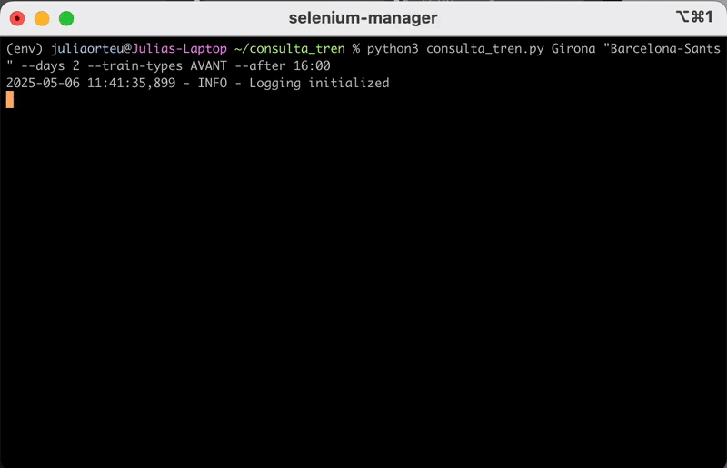

# Renfe Train Scraper

A Python tool for searching train tickets on Renfe's website with filtering options.

<p align="center">
  
</p>


## Features

- Search train tickets between any stations
- Filter by train type (AVE, AVANT, MD)
- Filter by departure time
- Look for trains up to 15 days ahead

## Installation

```bash
git clone https://github.com/juliaorteu/renfe-scraper.git
cd renfe-scraper
pip install -r requirements.txt
```

Requires Python 3.7+ and Chrome with ChromeDriver.

## Usage

Basic:
```bash
python consulta_tren.py  "Girona" "Barcelona-Sants"
```

Advanced:
```bash
python consulta_tren.py "Girona" "Barcelona-Sants" --days 2 --train-types AVANT --after 16:00
```

## Arguments

- `origin` - Origin station
- `destination` - Destination station
- `-d, --days` - Days ahead (0-15)
- `-t, --train-types` - Train types to include, choices = ["AVE", "AVANT", "MD", "ALL"]
- `--before HH:MM` - Filter for trains before time
- `--after HH:MM` - Filter for trains after time
- `-q, --quiet` - Less verbose output

## As a Library

```python
from renfe_scraper import RenfeSeleniumScraper

scraper = RenfeSeleniumScraper(
    origin="Girona",
    destination="Barcelona-Sants",
    days_from_now=2,
    train_types=["AVANT"]
)

results = scraper.run()
```
---
🚀 Created for quick terminal train lookups. Say goodbye to slow website navigation and hello to instant train availability - especially useful for those early morning commuter checks ;)
